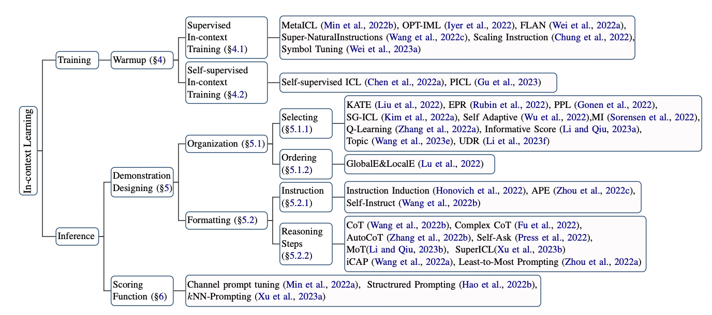

# Knowledge-Injection-Paper-List

## In-context Learning
### Survey paper

* [A Survey on In-context Learning](https://arxiv.org/pdf/2301.00234.pdf)

###  In-context training
* [MetaICL: Learning to Learn In Context](https://aclanthology.org/2022.naacl-main.201/)
* [OPT-IML: Scaling Language Model Instruction Meta Learning through the Lens of Generalization](https://arxiv.org/abs/2212.12017)
* [FLAN: Finetuned Language Models are Zero-Shot Learners](https://openreview.net/forum?id=gEZrGCozdqR)
* [Super-NaturalInstructions: Generalization via Declarative Instructions on 1600+ NLP Tasks](https://arxiv.org/abs/2204.07705)
* [Scaling Instruction: Scaling Instruction-Finetuned Language Models](https://arxiv.org/abs/2210.11416)
* [Symbol Tuning: Symbol tuning improves in-context learning in language models](https://arxiv.org/abs/2305.08298)
* [Self-supervised ICL: Improving In-Context Few-Shot Learning via Self-Supervised Training](https://aclanthology.org/2022.naacl-main.260/)
* [PICL: Pre-Training to Learn in Context](https://arxiv.org/abs/2305.09137)

### Demenstration desgin
* [KATE: What Makes Good In-Context Examples for GPT-3?](https://aclanthology.org/2022.deelio-1.10/)
* [EPR: Learning To Retrieve Prompts for In-Context Learning](https://aclanthology.org/2022.naacl-main.191/)
* [PPL: Demystifying Prompts in Language Models via Perplexity Estimation](https://arxiv.org/abs/2212.04037)
* [SG-ICL: Self-Generated In-Context Learning: Leveraging Auto-regressive Language Models as a Demonstration Generator](https://arxiv.org/abs/2206.08082)
* [Self-Adaptive In-Context Learning: An Information Compression Perspective for In-Context Example Selection and Ordering](https://arxiv.org/abs/2212.10375)
* [An Information-theoretic Approach to Prompt Engineering Without Ground Truth Labels](https://aclanthology.org/2022.acl-long.60/)
* [Q-Learning: Active Example Selection for In-Context Learning](https://arxiv.org/abs/2211.04486)
* [MI: Finding supporting examples for in-context learning](https://arxiv.org/abs/2302.13539)
* [Topic Model: Large Language Models Are Implicitly Topic Models: Explaining and Finding Good Demonstrations for In-Context Learning](https://arxiv.org/abs/2301.11916)
* [UDR: Unified Demonstration Retriever for In-Context Learning](https://arxiv.org/abs/2305.04320)
* [Ordering: Fantastically Ordered Prompts and Where to Find Them: Overcoming Few-Shot Prompt Order Sensitivity](https://aclanthology.org/2022.acl-long.556/)

### Instruction learning
* [Instruction Induction: From Few Examples to Natural Language Task Descriptions](https://arxiv.org/abs/2205.10782)
* [Large Language Models Are Human-Level Prompt Engineers](https://arxiv.org/abs/2211.01910)
* [Self-Instruct: Aligning Language Models with Self-Generated Instructions](https://arxiv.org/abs/2212.10560) 

### Multi-hop reasoning
* [CoT: Self-Instruct: Aligning Language Models with Self-Generated Instructions](https://arxiv.org/abs/2212.10560) 
* [Complex CoT: Complexity-Based Prompting for Multi-Step Reasoning](https://arxiv.org/abs/2210.00720)
* [AutoCoT: Automatic Chain of Thought Prompting in Large Language Models](https://arxiv.org/abs/2210.03493)
* [Measuring and Narrowing the Compositionality Gap in Language Models](https://arxiv.org/abs/2210.03350)
* [MoT: Pre-thinking and Recalling Enable ChatGPT to Self-Improve with Memory-of-Thoughts](https://arxiv.org/abs/2305.05181)
* [Small Models are Valuable Plug-ins for Large Language Models](https://arxiv.org/abs/2305.08848)

## Prompt-based Methods
* [KnowPrompt: Knowledge-aware Prompt-tuning with Synergistic Optimization for Relation Extraction](https://dl.acm.org/doi/abs/10.1145/3485447.3511998?casa_token=1q-XyTkqEM4AAAAA:Wt3G5IX-KkFIfDCMD9GGt94wnO0TgqkSQwE-ClbqhynqD07zSkpJJ6ckGWBbaf_iEU6GkqGJl3ZSjg)
* [Ontology-enhanced Prompt-tuning for Few-shot Learning](https://dl.acm.org/doi/abs/10.1145/3485447.3511921?casa_token=5nwfixty1ekAAAAA:-7oXtfRQZ1AHtzHw4Mhp7zM88CtWQqRJ7rpu0CLTRUk62CQE5kdK8rzVbc7nREz5PTwHYJqXipLeFw)
* [KiPT: Knowledge-injected Prompt Tuning for Event Detection](https://aclanthology.org/2022.coling-1.169/)
* [Knowledge Injected Prompt Based Fine-tuning for Multi-label Few-shot ICD Coding](https://arxiv.org/abs/2210.03304)
* [Check Your Facts and Try Again: Improving Large Language Models with External Knowledge and Automated Feedback](https://arxiv.org/abs/2302.12813)

## Model Editing
* [Do Language Models Have Beliefs? Methods for Detecting, Updating, and Visualizing Model Beliefs](https://arxiv.org/abs/2111.13654)
* [BeliefBank: Adding Memory to a Pre-Trained Language Model for a Systematic Notion of Belief](https://arxiv.org/abs/2109.14723)
* [Editable neural networks](https://arxiv.org/abs/2004.00345)
* [KINS: Knowledge Injection via Network Structuring](https://cris.unibo.it/bitstream/11585/899494/1/paper_25.pdf)
* [Modifying Memories in Transformer Models](https://arxiv.org/abs/2012.00363)
* [Memory-Based Model Editing at Scale](https://proceedings.mlr.press/v162/mitchell22a.html?_hsenc=p2ANqtz-8PcBZg33YLCBAVdcZ55PYZXm2xs6OJ8qM1z5cu9NWDbYyx8ey70v--e65rovexQfK34-tjgKdTMqKyU1nNVowzXjY-bA&_hsmi=226067236&utm_source=pocket_mylist)
* [Editing Factual Knowledge in Language Models](https://arxiv.org/abs/2104.08164)
* [Locating and Editing Factual Associations in GPT](https://openreview.net/forum?id=-h6WAS6eE4)
* [Transformer Feed-Forward Layers Are Key-Value Memories](https://arxiv.org/abs/2012.14913)
* [Mass-Editing Memory in a Transformer](https://arxiv.org/abs/2210.07229)
* [Fast Model Editing at Scale](https://arxiv.org/abs/2110.11309)

## Adapter-based methods
* [Kformer: Knowledge Injection in Transformer Feed-Forward Layers](https://link.springer.com/chapter/10.1007/978-3-031-17120-8_11)
* [Plug-and-Play Knowledge Injection for Pre-trained Language Models](https://openreview.net/forum?id=f4RClsuGaHS)
* [Common Sense or World Knowledge? Investigating Adapter-Based Knowledge Injection into Pretrained Transformers](https://arxiv.org/abs/2005.11787)
* [The Effectiveness of Masked Language Modeling and Adapters for Factual Knowledge Injection](https://arxiv.org/abs/2210.00907)

## Others

## Evaluation

* [Evaluation of ChatGPT as a Question Answering System for Answering Complex Questions](https://arxiv.org/abs/2303.07992)
